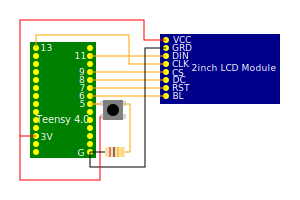

# OB1
## One Button only Game console.

Creativity can thrive when constains are severe. 
So here is the challenge:

### "Write programms that can do something with only one button."

This project has started to explore exactly this.
I connected a [Teensy 4.0](https://www.pjrc.com/store/teensy40.html) to a 
[Waveshare 2" LCD Module](https://www.waveshare.com/wiki/2inch_LCD_Module) 
with the [Arduino_GFX](https://github.com/moononournation/Arduino_GFX) 
library to drive the ST7789. As Button I use a [Mini Pushbutton Switch](https://www.sparkfun.com/products/97).

## Wiring
| LCD | Teensy |
| --- | ------ |
| VCC | 3V     |
| GRD | G      |
| DIN | 11     |
| CLK | 13     |
| CS  | 9      |
| DC  | 8      |
| RST | 7      |
| BL  | 6      |

